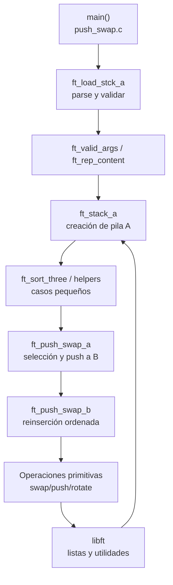

# Push Swap – Arquitectura

## Visión general del diseño
- Entrada `main` (`push_swap.c`) orquesta la validación, creación de las pilas y la estrategia de ordenación por fases.
- Los datos se modelan sobre `t_list` de `libft`, evitando estructuras propias y reutilizando operaciones de lista enlazada.
- El flujo pivota entre dos pilas (A y B): primero se extraen elementos de A a B para reducir el problema (`ft_push_swap_a`), después se reinsertan en orden (`ft_push_swap_b`).
- Las operaciones primitivas sobre las pilas (`swap`, `push`, `rotate`, `reverse rotate`) están agrupadas en la familia `push_swap_utils*.c` y emiten las instrucciones requeridas por el evaluador.
- Funciones auxiliares calculan costes de rotación y seleccionan objetivos óptimos para minimizar operaciones.
- Se consultó el subject, pero no se encuentra dentro del repositorio actual; el análisis se basa en el código provisto.

## Tecnologías utilizadas
- Lenguaje C (compilado con `cc` y banderas `-Wall -Wextra -Werror`).
- Sistema de construcción con `make` y `Makefile` raíz.
- Librería personalizada `libft` (implementaciones de listas, strings, memoria y utilidades numéricas).
- Uso de cabeceras estándar de C: `<stddef.h>`, `<stdlib.h>`, `<limits.h>`, además de funciones de `unistd.h` implícitas por uso de `write`.

## Estructura de directorios y archivos
```text
.
├── arquitectura.md
├── Makefile
├── push_swap.c
├── push_swap.h
├── push_swap_utils.c
├── push_swap_utils1.c
├── push_swap_utils2.c
├── push_swap_utils3.c
├── push_swap_utils4.c
├── push_swap_utils5.c
└── libft/
    ├── Makefile
    ├── libft.h
    ├── ft_abs.c
    ├── ft_atoi.c
    ├── ft_atoi_base.c
    ├── ft_atol.c
    ├── ft_bzero.c
    ├── ft_calloc.c
    ├── ft_convert_base.c
    ├── ft_convert_int.c
    ├── ft_doubleptr_len.c
    ├── ft_esc_char.c
    ├── ft_fibonacci.c
    ├── ft_find_in_matrix.c
    ├── ft_free_d.c
    ├── ft_free_prev_d.c
    ├── ft_isalnum.c
    ├── ft_isalpha.c
    ├── ft_isascii.c
    ├── ft_isdigit.c
    ├── ft_isprint.c
    ├── ft_iterative_factorial.c
    ├── ft_itoa.c
    ├── ft_longlen.c
    ├── ft_lstadd_back_bonus.c
    ├── ft_lstadd_front_bonus.c
    ├── ft_lstclear_bonus.c
    ├── ft_lstdelone_bonus.c
    ├── ft_lstiter_bonus.c
    ├── ft_lstlast_bonus.c
    ├── ft_lstmap_bonus.c
    ├── ft_lstnew_bonus.c
    ├── ft_lstsize_bonus.c
    ├── ft_memchr.c
    ├── ft_memcmp.c
    ├── ft_memcpy.c
    ├── ft_memmove.c
    ├── ft_memset.c
    ├── ft_nbr_base_len.c
    ├── ft_neg.c
    ├── ft_power.c
    ├── ft_putchar.c
    ├── ft_putchar_fd.c
    ├── ft_putendl_fd.c
    ├── ft_putnbr.c
    ├── ft_putnbr_base.c
    ├── ft_putnbr_fd.c
    ├── ft_putstr_fd.c
    ├── ft_putstr_non_printable.c
    ├── ft_rev_char_tab.c
    ├── ft_rev_int_tab.c
    ├── ft_sort_int_tab.c
    ├── ft_split.c
    ├── ft_strchr.c
    ├── ft_strcpy.c
    ├── ft_strdup.c
    ├── ft_striteri.c
    ├── ft_strjoin.c
    ├── ft_strlcat.c
    ├── ft_strlcpy.c
    ├── ft_strlen.c
    ├── ft_strmapi.c
    ├── ft_strnchr.c
    ├── ft_strncmp.c
    ├── ft_strncpy.c
    ├── ft_strndup.c
    ├── ft_strnstr.c
    ├── ft_strrchr.c
    ├── ft_strstr.c
    ├── ft_strtrim.c
    ├── ft_substr.c
    ├── ft_swap.c
    ├── ft_tolower.c
    └── ft_toupper.c
```

## Componentes principales
- **Entrada y validación**: `ft_valid_args`, `ft_load_stck_a`, `ft_rep_content` depuran la entrada, dividen cadenas con espacios y descartan duplicados o caracteres inválidos antes de formar la pila A.
- **Gestión de pilas**: `ft_stack_a` crea nodos `t_list` con enteros, `ft_copy_content` replica contenidos cuando es necesario.
- **Algoritmo de ordenación**:
  - Fase 1 (`ft_push_swap_a`): expulsa elementos de A a B seleccionando objetivos con `ft_choose_target_a` para favorecer inserciones posteriores.
  - Fase 2 (`ft_push_swap_b`): calcula costes (`ft_choose_op`, `ft_rot_cost`, `ft_rot_cos`) y reintroduce elementos en A mediante rotaciones conjuntas o individuales.
- **Operaciones primitivas**: `ft_swap_*`, `ft_push_*`, `ft_rotate_*`, `ft_rev_rot_*` encapsulan las instrucciones del problema y garantizan que cada acción quede reflejada en la salida estándar.
- **Soporte `libft`**: provee listas enlazadas, utilidades de strings y conversiones numéricas imprescindibles para parseo y manipulación de datos.

## Algoritmo Turco en este proyecto
- Objetivo: mantener `stack_b` en orden decreciente mientras se reduce el tamaño de `stack_a`, de modo que cada operación `pa` posterior coloque el elemento en el lugar correcto con la menor cantidad de movimientos.
- Selección adaptativa: `ft_choose_target_a` recorre `stack_a` calculando para cada nodo el coste combinado de llevarlo a la cima (rotación positiva o negativa) y de alinear su posición destino en `stack_b` (`ft_find_node_target_b`). Se queda con el candidato que minimiza la suma absoluta de movimientos (`ft_abs(ft_choose_op(...))`), replicando la heurística central del algoritmo Turco.
- Sincronización de rotaciones: `ft_rot_cost` y `ft_rot_cos` agrupan rotaciones dobles (`rr`, `rrr`) cuando ambas pilas requieren el mismo sentido, evitando movimientos redundantes antes de ejecutar `pb` o `pa`.
- Reconstrucción ordenada: durante `ft_push_swap_b` se invierte el proceso, esta vez eligiendo el nodo óptimo de `stack_b` mediante `ft_choose_target_b`, que usa `ft_find_node_target_a` para localizar el punto de inserción en `stack_a`. La invariante es que `stack_a` se mantiene creciente tras cada `pa`.
- Ajuste final: `ft_choose_op(*stack_a, ft_find_min(*stack_a))` produce la rotación mínima para dejar el elemento más pequeño en la cima, completando el orden ascendente exigido por push_swap.

## Flujo de trabajo
- Parseo de argumentos y conversión a enteros almacenados en la pila A.
- Caso base: ordenaciones pequeñas con `ft_sort_two`, `ft_sort_three`, `ft_sort_four`.
- Descomposición del problema: selección del mejor candidato de A para mover a B según costes O(n).
- Reconstrucción ordenada: combinación de rotaciones sincronizadas y segregadas para minimizar la cuenta de movimientos antes de cada `pa`.
- Rotación final para alinear el mínimo en la cima de A.

## Diagrama de arquitectura

